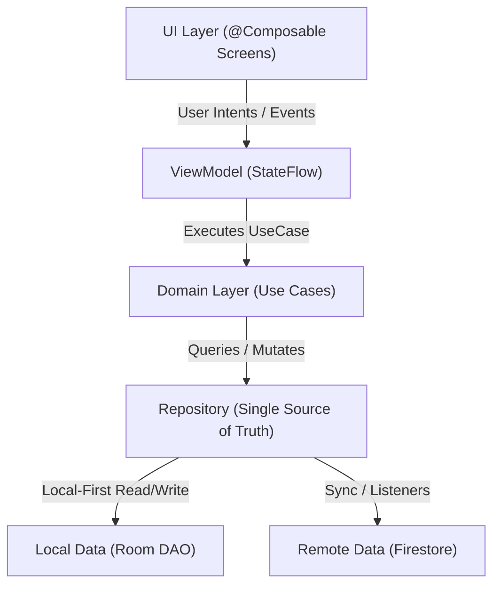

# Playbook: Android Development Standards & Invariants

> **Scope**: Core Android development rules, Clean Architecture (MVI), 3-State Access Parity, Zero Hardcoded Strings, and Accessibility contracts.  
> **Primary Consumers**: Persona 4 (System Architect) & Persona 5 (Software Engineer).

---

## 1. Zero Hardcoded Strings

All user-facing strings must reside exclusively in Android string resources. Hardcoding strings in Kotlin Compose or XML is strictly forbidden.

### String Resource Contracts
- **English Source**: `app/src/main/res/values/strings.xml`
- **French Source**: `app/src/main/res/values-fr/strings.xml`
- Every new string key added to English **must** have its corresponding translation in French.

```kotlin
// ✅ Correct Compose consumption
Text(text = stringResource(R.string.dashboard_title))
Icon(
    imageVector = Icons.Default.ArrowBack,
    contentDescription = stringResource(R.string.cd_back_button)
)

// Dynamic formatting — always use positional specifiers
Text(text = stringResource(R.string.items_count, count))
// In strings.xml:
// <string name="items_count">You have %1$d items</string>
// In values-fr/strings.xml:
// <string name="items_count">Vous avez %1$d éléments</string>

// ❌ FORBIDDEN: Raw string literals
Text("Welcome back")
Icon(contentDescription = "Close")
```

### Pre-Commit & Lint Enforcement
- Pre-commit hook (`.agent/hooks/pre-commit-airbag.sh`) scans staged Kotlin files for string literals in `Text(...)` and `contentDescription = ...`.
- Android Lint check (`HardcodedText`) is enabled in `lint.xml` and runs during `./gradlew codeSanityCheck`.

---

## 2. 3-State Access Parity (Guest · Solo · Duo)

Agentic Android Kernel functions across three distinct access tiers. Every feature must explicitly support this matrix without data corruption or unauthorized network traffic.

| State | Authentication & Linking | Storage & Network Invariants |
|---|---|---|
| **Guest** | `isGuest == true` | **100% Room SQLite local persistence**. Zero unsolicited Firestore network requests. Any cloud-only action triggers `AuthRequiredDialog`. |
| **Solo** | `isAuthenticated && !isPartnerLinked` | Personal cloud sanctuary. Syncs strictly under personal namespace `user_${uid}`. |
| **Duo** | `isAuthenticated && isPartnerLinked` | Shared collaborative space. Real-time Firestore sync across partners, collaborative energy ledger, and shared notes. |

### Architectural Invariant
- **Local-First Always**: Room cache is always written first before any remote sync attempt.
- Network errors must never crash the UI; map network exceptions to `UiState.Error` with user-friendly retry affordance.

---

## 3. Clean Architecture & Unidirectional Data Flow (MVI)

Strict layer boundaries must be maintained across all modules:



### Layer Contracts
1. **UI Layer (`ui/`)**:
   - Composable screens and design components.
   - Stateless and hoisting state where possible.
   - Strictly consumes `UiState` via `collectAsStateWithLifecycle()`.
2. **ViewModel Layer (`ui/viewmodel/`)**:
   - Exposes a single `StateFlow<UiState>`.
   - Accepts sealed `UiIntent` / `UiEvent` classes.
   - Zero Android UI framework imports (`android.view.*`, `android.widget.*`).
3. **Domain Layer (`domain/`)**:
   - Pure Kotlin business logic and Use Cases.
   - Coroutine-safe (`suspend fun` or `Flow<T>`).
4. **Data Layer (`data/`)**:
   - Repositories arbitrate between local Room and remote Firestore.
   - Room DAOs provide immediate offline reactivity (`Flow<List<Entity>>`).

---

## 4. Accessibility Contracts (a11y)

All Compose components must satisfy Android Accessibility guidelines:
- **Touch Target Size**: Minimum `48.dp` for standard clickable elements (buttons, chips), `56.dp` for Floating Action Buttons (FAB).
- **Color Contrast**: Compliant with WCAG 2.1 AA across both Light and Dark themes (minimum `4.5:1` for body text, `3:1` for large text and UI controls). WCAG AAA (`7:1`) preferred for primary body copy.
- **Semantics**: All interactive or informative icons must carry `contentDescription` referencing a string resource. Purely decorative elements must explicitly pass `contentDescription = null`.

---

## 5. Canonical Build & Quality Commands

| Command | Scope |
|---|---|
| `./gradlew testDebugUnitTest` | Runs unit tests (Robolectric, ViewModels, Repositories). |
| `./gradlew assembleDebug` | Compiles the Android debug APK. |
| `./gradlew lintDebug` | Executes Android Lint analysis on debug variant. |
| `./gradlew codeSanityCheck` | Comprehensive CI check (Kotlin compilation, Lint, unit tests). |
