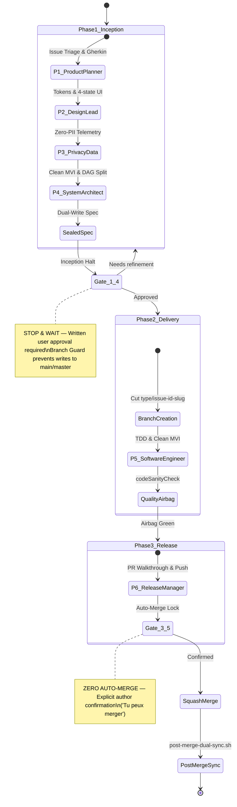

# ARCHITECTURE.md — The Agentic Android Delivery Protocol

> **Specification Version**: 2.0.0  
> **Core Framework**: Antigravity Micro-Kernel (< 10 KB)  
> **Target Platform**: Android (Jetpack Compose, Roborazzi, Gradle)

---

## 1. Architectural Philosophy

The **Agentic Android Delivery Kernel** enforces a strict separation between **strategic intent** (what needs to be built and why) and **tactical implementation** (writing code and modifying files). 

To prevent hallucinations, unmonitored scope drift, and code regressions, the agent does not operate as a single monolithic actor. Instead, it transitions through a **deterministic sequential state machine** governed by 6 specialized engineering personas and 2 mandatory human validation gates.

---

## 2. The 3 Phases & 2 Blocking Gating Locks

---

## 3. The 6 Engineering Personas — RACI Matrix

| Persona | Name | Role | Responsibilities | Disallowed Actions |
|---|---|---|---|---|
| **P1** | Product Planner | Product Management | Anti-duplication, sealed issues, User Stories (Gherkin), 3-State Access Matrix | Direct code edits, branch cutting, merging |
| **P2** | Design Lead | Design & UX Lead | Material 3 tokens, WCAG AAA compliance, 4-state UI matrix (`Loading`, `Empty`, `Error`, `Content`) | Writing backend or application code |
| **P3** | Privacy & Data | Data Protection & Telemetry | Zero-PII telemetry contracts, GDPR/AI Act compliance, event taxonomy | Introducing PII in analytics or logs |
| **P4** | System Architect | Tech Lead & Architecture | Boundary audits, Unidirectional Data Flow (MVI), Epic DAG decomposition (< 300 LOC) | Writing production code directly |
| **P5** | Software Engineer | Senior Android Developer | Production Kotlin/Compose implementation, unit & screenshot tests, zero hardcoding | Direct commits to main, scope creep |
| **P6** | Release Manager | QA & Release Management | Quality Airbag verification, PR Walkthrough, SemVer tracking, Zero Auto-Merge enforcement | Merging autonomously without confirmation |

---

## 4. Deterministic Guardrails & Tool Interception

The framework installs runtime safety hooks directly intercepting agent tool executions:

### 4.1 Native Branch Guard (`branch-guard.mjs`)
* **Hook Type**: `PreToolUse` on `write_to_file` and `replace_file_content`.
* **Action**: Dynamically queries the current git branch. If the branch matches the default branch (`main` or `master`), the tool call is **denied with an actionable error**, preventing accidental commits or unapproved code edits.
* **Exceptions**: Antigravity brain artifacts (`implementation_plan.md`, `walkthrough.md`, `.gemini/antigravity/brain/*`).

### 4.2 Pre-Invocation Cognitive Anchor (`pre-invocation-anchor.sh`)
* **Hook Type**: `PreInvocation`.
* **Action**: Injects an ephemeral system prompt reminder into every agent turn indicating the active git branch and current loop phase, preventing context loss across multi-turn sessions.

### 4.3 Pre-Commit Airbag (`pre-commit-airbag.sh`)
* **Hook Type**: Git hook linked via `scripts/install-hooks.sh`.
* **Action**:
  1. Scans staged Kotlin diffs for unextracted literals in `Text(...)` and `contentDescription`.
  2. Executes `./scripts/validate-docs.sh`.
  3. Executes `./scripts/quality-check.sh` (`./gradlew codeSanityCheck`).

---

## 5. System Invariants

1. **Rule 0 (Issue-First)**: Every branch and PR must originate from an existing, sealed GitHub Issue.
2. **Rule A (Append-Only Immutability)**: Issue titles and initial descriptions are append-only. Scope modifications are recorded via comments.
3. **Rule 0.1 (Epic Gating)**: Issues evaluated as `Size: L` or `Size: XL` must be decomposed into atomic child tasks (< 300 LOC) before implementation.
4. **WIP = 1**: Strictly one issue in progress and at most one PR under review at any time.
5. **Zero Auto-Merge**: The agent halts at Gate 3.5 and never merges autonomously.
