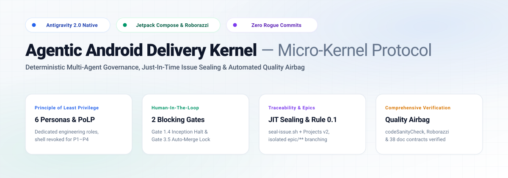

<p align="center">
  
</p>

<p align="center">
  <a href="https://github.com/nicolasvd/agentic-android-delivery-kernel/actions/workflows/delivery-pipeline.yml"></a>
  <a href="https://developer.android.com/jetpack/compose"></a>
  <a href="https://github.com/takahirom/roborazzi"></a>
  <a href="https://github.com/users/nicolasvd/projects/2"></a>
  <a href="LICENSE"></a>
  <a href="kernel.config.json"></a>
</p>

---

# 🛡️ Agentic Android Delivery Kernel

> **The Deterministic Multi-Agent Governance Protocol for Production Android Apps**  
> *Powered by Google Antigravity · Jetpack Compose · Roborazzi · Gradle Quality Airbag*

---

## 🌟 Executive Overview & Value Proposition

Autonomous AI coding agents often derail when given unbounded write access to production codebases:
* **Direct commits on `main` / `master`** bypassing branch protection and peer review.
* **Premature implementation** without sealed product specifications or human approval.
* **Unmonitored autonomous merges** and unverified tests causing silent regressions.
* **Hardcoded UI literals** breaking internationalization and accessibility.
* **Hallucinated dependencies and architectural drift** that degrade repository maintainability.

**Agentic Android Delivery Kernel** is an architectural framework and deterministic micro-kernel (< 10 KB) designed to enforce strict software engineering rigor on AI agents. It orchestrates **6 specialized engineering personas** across a sequential state machine with **2 human-in-the-loop blocking gates**, guaranteeing that no code is written, tested, or released without formal human authorization.

---

## 🏛️ Sequential Persona State Machine & Gating Verification

The kernel governs agent operations through a strict **3-Phase Deterministic Lifecycle** with an essential **Testing / Quality Airbag** verification step prior to release:

```mermaid
flowchart TD
    subgraph Inception["Phase 1 · Inception Consortium"]
        P1["P1: Product Planner\nAnti-duplication & Gherkin User Stories"] --> P2["P2: Design Lead\nM3 Tokens, 4-State UI Matrix"]
        P2 --> P3["P3: Privacy & Data\nZero-PII, Analytics Taxonomy, GDPR"]
        P3 --> P4["P4: System Architect\nClean MVI, Boundaries, Epic DAG Decomposition"]
        P4 --> Spec["Dual-Write Spec\nLocal implementation_plan.md"]
    end

    Spec --> Gate14{"🛑 GATE 1.4 : Inception Halt\nExplicit Written Approval\n(Branch Guard active on main & epic/**)"}

    subgraph Sealing["Just-In-Time (JIT) Sealing"]
        Gate14 -->|Explicit approval| JIT["JIT Issue Sealer\n./scripts/seal-issue.sh --from-plan\nAtomic GitHub Issue & Project v2 Sync"]
    end

    subgraph Delivery["Phase 2 · Construction & Delivery"]
        JIT --> Branch["Dedicated Feature Branch\n<type>/issue-<id>-<slug> (WIP = 1)"]
        Branch --> P5["P5: Software Engineer\nTDD & Strict Compose Implementation\nZero Hardcoded Strings (strings.xml)"]
    end

    subgraph Testing["Testing & Verification"]
        P5 --> Airbag["🛡️ Quality Airbag\n./scripts/quality-check.sh\n(codeSanityCheck + Lint + Roborazzi)\n& ./scripts/validate-docs.sh (38 Contracts)"]
    end

    subgraph Release["Phase 3 · Release & Observability"]
        Airbag -->|100% green checks| P6["P6: Release Manager\nGit Push & Open PR Walkthrough"]
        P6 --> Gate35{"🔒 GATE 3.5 : Auto-Merge Lock\nHuman Authorization Required\n('Tu peux merger')"}
        Gate35 -->|Written confirmation| Merge["Squash Merge & Dual-Sync\nKanban Closure & Branch Pruning"]
    end

    style Gate14 fill:#ff4d4f,stroke:#333,stroke-width:2px,color:#fff
    style Gate35 fill:#ff4d4f,stroke:#333,stroke-width:2px,color:#fff
    style Airbag fill:#52c41a,stroke:#333,stroke-width:2px,color:#fff
    style JIT fill:#1890ff,stroke:#333,stroke-width:2px,color:#fff
```



### The 3 Core Lifecycle Phases

1. **Phase 1 — Inception Consortium (Personas 1–4)**:
   - **Persona 1 (Product Planner)** executes an anti-duplication query via `GitHubMCP:search_issues`.
   - The Consortium drafts a formal 4-Pillar Specification in the local `implementation_plan.md` artifact.
   - Persona 4 consolidates sizing (`XS` to `XL`) and estimates before sealing.
   - **Gate 1.4 Verification (STOP & WAIT)**: Strict halt. Zero branches, code edits, or premature GitHub issues before explicit written approval.
   - Upon Gate 1.4 approval: `./scripts/seal-issue.sh --from-plan` seals the tracking issue assigned to `@me` with native flags (`--milestone`, `--parent`), associates Project v2 fields (`Priority`, `Size`, `Estimate`, `Status: Ready`), and initializes integration branches if Epic.

2. **Phase 2 — Construction & Delivery (Persona 5)**:
   - Activated **strictly after** Gate 1.4 approval and JIT sealing.
   - P5 cuts a dedicated branch `<type>/issue-<id>-<slug>` from default branch or active Epic branch (`WIP = 1`).
   - Production implementation adheres to Clean MVI architecture, strict Compose theming, and zero hardcoded literals.
   - **Testing / Quality Airbag**: Execution of `./scripts/quality-check.sh` (`codeSanityCheck`, Android Lint debug/release, Roborazzi visual regressions) and `./scripts/validate-docs.sh` (38 documentation contracts).

3. **Phase 3 — Release & Observability (Persona 6)**:
   - Activated after all Quality Airbag assertions pass 100% green.
   - Persona 6 pushes the branch and opens a Pull Request with a structured Walkthrough via `GitHubMCP:create_pull_request`.
   - PR targets `epic/**` with `skip-release` for intermediate child tasks; targets `main` for standalone or consolidated Epic releases.
   - **Gate 3.5 — Zero Auto-Merge Lock**: Strict halt with PR link. Merges exclusively after explicit user confirmation (*"Tu peux merger"*).
   - Executes squash merge, runs `.agent/hooks/post-merge-dual-sync.sh` (dynamically synchronizing base branch), and prunes branches.

### Conditional Persona 2 Design Gate

Pillar 1 (Design Spec) enforcement is contextual and adaptive:
* **UI & Composable Changes**: **Persona 2 (Design Lead)** must define Material 3 tokens (from [`DESIGN.md`](DESIGN.md)), 4-state UI matrix (`Loading`, `Empty`, `Error`, `Content`), and Roborazzi expectations.
* **Non-UI Changes**: For backend, Room, CI/CD, scripts, or doc chores, Pillar 1 is explicitly marked: `N/A — No visual/UI changes`.
* **Explicit User Override**: If prompt requests to skip design (*"skip design"*, *"sans design"*), P2 is immediately bypassed.

---

## 👥 The 6 Engineering Personas & Principle of Least Privilege (PoLP)

The kernel divides operational responsibilities into 6 distinct personas. To guarantee security and prevent unintended file modifications, the **Principle of Least Privilege (PoLP)** is enforced at runtime:

| Persona | Manifest | Role & Deliverables | Metadata Ownership | Shell Execution (`run_command`) |
|---|---|---|---|:---:|
| **P1 · Product Planner** | [p1-product-planner.md](.agent/personas/p1-product-planner.md) | Anti-duplication, Gherkin User Stories, 3-State Access Matrix, Milestone hygiene | `Priority`, `Estimate` (co-owner) | ❌ **Revoked** |
| **P2 · Design Lead** | [p2-design-lead.md](.agent/personas/p2-design-lead.md) | Material 3 tokens, WCAG AAA compliance, 4-state UI matrix, Roborazzi specs | Pillar 1 Design Spec | ❌ **Revoked** |
| **P3 · Privacy & Data** | [p3-privacy-data.md](.agent/personas/p3-privacy-data.md) | Zero-PII telemetry contracts, GDPR/AI Act compliance, event taxonomy | Pillar 2 Data Spec | ❌ **Revoked** |
| **P4 · System Architect** | [p4-system-architect.md](.agent/personas/p4-system-architect.md) | Clean Arch, Room DDL, boundary audit, Epic DAG decomposition (< 300 LOC) | `Size` (XS–XL), `Estimate` (co-owner) | ❌ **Revoked** |
| **P5 · Software Engineer** | [p5-software-engineer.md](.agent/personas/p5-software-engineer.md) | Kotlin/Compose implementation, Clean MVI, Zero Hardcoded Strings, TDD | Working code, atomic commits | ✅ **Allowed (Dedicated branch only)** |
| **P6 · Release Manager** | [p6-release-manager.md](.agent/personas/p6-release-manager.md) | Quality Airbag, PR walkthrough, Milestone release train, Crashlytics sync | PR Lifecycle, Tier 1/2 releases | ✅ **Allowed (Release ops only)** |

---

## 🛡️ Core Governance & System Invariants

1. **Rule 0 (JIT Issue-First)**: Zero code, branch, or premature GitHub issue stubs before Gate 1.4. Issues are sealed Just-In-Time via `./scripts/seal-issue.sh` only after human approval.
2. **Rule 0.1 (Epic Branch Isolation Protocol)**: Epics (`Size: L/XL`) establish an isolated integration branch `epic/issue-<id>-<slug>`. Direct commits on `epic/**` are strictly forbidden. Implementation proceeds via atomic child issues (< 300 diff lines) branching from and merging into `epic/**` before a consolidated release PR lands on `main`.
3. **Rule A (Append-Only Immutability)**: Issue title and body are permanently read-only once created. Revisions are appended exclusively via comments.
4. **WIP = 1 (Single Active Pair)**: Exactly 1 issue `In Progress` and at most 1 PR `In Review` at any time (Macro Epic in progress, Micro child WIP = 1).
5. **Dual-Write Pattern**: Canonical remote GitHub issue synchronized with local `implementation_plan.md` mirror for IDE harmony.
6. **Zero Auto-Merge Lock (Gate 3.5)**: The agent never merges autonomously without human confirmation (*"Tu peux merger"*).
7. **Runtime Bypass Guardrails**:
   * **`branch-guard.mjs`**: PreToolUse hook intercepting file write tools (`write_to_file`, `replace_file_content`), blocking edits on protected branches (`main`, `epic/**`).
   * **`plan-guard.mjs`**: PreToolUse hook intercepting shell executions, blocking `--no-verify`, inline hooks overrides (`-c core.hooksPath`), and direct git pushes to protected branches.

---

## 📁 Repository Architecture & Directory Layout

```text
.
├── .agent/
│   ├── hooks/                     # Runtime tool interception & safety guards
│   │   ├── branch-guard.mjs       # Blocks file writes on protected branches (main, epic/**)
│   │   ├── plan-guard.mjs         # Blocks bypasses (--no-verify, -c core.hooksPath)
│   │   ├── pre-commit-airbag.sh   # Staged lint, doc checks & zero-hardcoding verification
│   │   └── post-merge-dual-sync.sh# Dynamic base-branch synchronization & branch cleanup
│   ├── personas/                  # 6 Declarative Engineering Persona manifests (PoLP)
│   │   ├── p1-product-planner.md
│   │   ├── p2-design-lead.md
│   │   ├── p3-privacy-data.md
│   │   ├── p4-system-architect.md
│   │   ├── p5-software-engineer.md
│   │   └── p6-release-manager.md
│   ├── playbooks/                 # Modular engineering playbooks (< 8,500 bytes)
│   │   ├── android-standards.md   # Kotlin, MVI, and Compose engineering standards
│   │   ├── compose-theming.md     # Material 3 tokens & typography implementation
│   │   ├── room-migrations.md     # SQLite DDL & Room schema migration protocols
│   │   └── roborazzi-export.md    # Screenshot testing & visual regression capture
│   ├── rules/                     # Core governance specifications (< 9,500 bytes)
│   │   ├── agent-lifecycle.md     # 3-Phase Lifecycle, Circuit Breaker, Dual-Write
│   │   ├── backlog-planner.md     # Inception Consortium, Rule 0/0.1/A, 10 Golden Rules
│   │   ├── git-workflow.md        # Conventional commits, SemVer, branch hygiene
│   │   └── firebase-standards.md  # Cloud architecture & Crashlytics synchronization
│   ├── sidecars/                  # Automated background listeners
│   │   └── sync-issue-progress.mjs# Auto-transitions issue to In Progress on checkout
│   ├── skills/                    # Native Antigravity semantic skills
│   │   ├── plan-issue/            # Inception & 4-Pillar framing skill
│   │   ├── open-pr/               # Release & Walkthrough delivery skill
│   │   ├── quality-airbag/        # Full sanity check validation skill
│   │   └── sync-stitch/           # Stitch MCP screenshot synchronization skill
│   └── templates/                 # Deterministic markdown templates
├── app/                           # Reference Android Starter Application
│   ├── src/main/java/             # Clean Jetpack Compose starter activity
│   └── src/test/java/             # Roborazzi screenshot verification test suite
├── docs/                          # Technical governance specifications
│   ├── analytics-taxonomy.md      # P3 Contract: Zero-PII event taxonomy
│   ├── qa-classification-test-guide.md # P6 Contract: QA test matrix & classification
│   └── scripts-reference.md       # Operational CLI scripts reference documentation
├── scripts/                       # Operational automation tooling
│   ├── install-hooks.sh           # Binds git hooks to .agent/hooks
│   ├── seal-issue.sh              # Just-In-Time issue sealing & Projects v2 synchronization
│   ├── quality-check.sh           # Complete Gradle sanity check execution
│   ├── validate-docs.sh           # Formal verification of 38 documentation contracts
│   └── sync-project-metadata.mjs  # Direct Projects v2 GraphQL metadata synchronization
├── AGENTS.md                      # Agent Micro-Kernel & Root Governance (< 10,000 bytes)
├── ARCHITECTURE.md                # Formal Architecture & State Machine Specification
├── DESIGN.md                      # Serene Intellectual Design Tokens (YAML frontmatter)
├── design-system.md               # Visual Component Matrix, 4-state specs & motion
├── kernel.config.json             # Declarative project configuration file
├── kernel.config.schema.json      # Formal JSON Schema validating kernel.config.json
└── README.md                      # Engineering Showcase & Documentation
```

---

## ⚙️ Declarative Configuration (`kernel.config.json`)

All repository-specific parameters are centralized in `kernel.config.json`, formally validated by `kernel.config.schema.json`:

```json
{
  "$schema": "./kernel.config.schema.json",
  "project": {
    "name": "My Android App",
    "description": "Production Android app governed by Antigravity",
    "version": "1.0.0"
  },
  "git": {
    "owner": "my-org",
    "repo": "my-android-app",
    "defaultBranch": "main"
  },
  "android": {
    "namespace": "com.example.myapp",
    "applicationId": "com.example.myapp",
    "minSdk": 26,
    "targetSdk": 35,
    "compileSdk": 35
  },
  "airbag": {
    "checkCommand": "./scripts/quality-check.sh",
    "validateDocsCommand": "./scripts/validate-docs.sh",
    "enforceZeroHardcodedStrings": true
  },
  "delivery": {
    "firebase": {
      "enabled": false,
      "appId": "",
      "testerGroups": "testers, dev",
      "artifactPath": "app/build/outputs/apk/release/app-release.apk"
    }
  }
}
```

---

## 🚀 Developer Quickstart in 4 Steps

### 1. Configure the Kernel
Clone the repository and adapt `kernel.config.json` with your project coordinates:
```bash
git clone https://github.com/<owner>/agentic-android-delivery-kernel.git my-app
cd my-app
# Customize kernel.config.json
```

### 2. Install Local Git Hooks
Bind local git hooks to `.agent/hooks` to activate the pre-commit airbag and branch guard:
```bash
./scripts/install-hooks.sh
```

### 3. Verify the Quality Airbag
Ensure compilation, Android Lint, Roborazzi screenshot assertions, and documentation contracts pass:
```bash
# Validate documentation contracts and byte budgets (38 checks)
./scripts/validate-docs.sh

# Run runtime guardrail test suite
node scripts/test-runtime-guardrails.mjs

# Execute full Android code sanity check
./scripts/quality-check.sh
```

### 4. Pair with the Agent
When initiating a feature or bug fix:
1. **Inception Prompt**: Prompt the agent with your user requirement. Persona 1 checks for duplicates and the Consortium drafts `implementation_plan.md`.
2. **Gate 1.4 Halt**: The agent halts and awaits your explicit approval.
3. **JIT Sealing**: Once approved, the issue is sealed automatically on GitHub with Projects v2 fields.
4. **Delivery & Testing**: Persona 5 implements code on `<type>/issue-<id>-<slug>` and verifies tests green.
5. **Gate 3.5 Release**: Persona 6 opens the PR and awaits your explicit command (*"Tu peux merger"*).

### 📋 Live Kanban Delivery Board (GitHub Projects v2)

Explore the live delivery board in action:  
👉 **[Live Delivery Board #2](https://github.com/users/nicolasvd/projects/2)** (`Agentic Delivery Board`)

The board is updated automatically in real-time by the kernel automation:
* **`Ready`**: Set at **Gate 1.4** upon JIT sealing via `./scripts/seal-issue.sh` with computed `Priority`, `Size`, and `Estimate`.
* **`In Progress`**: Synchronized automatically when Persona 5 checks out the dedicated branch.
* **`In Review`**: Set when Persona 6 opens the PR at Gate 3.5.
* **`Done`**: Updated atomically upon human-authorized merge and dual-sync.

---

## 📚 Technical Playbooks & Governance Registry

The kernel provides exhaustive technical playbooks and governance rules located in `.agent/`:

| Asset | Path | Summary & Focus |
|---|---|---|
| **Android Standards** | [`.agent/playbooks/android-standards.md`](.agent/playbooks/android-standards.md) | Clean MVI, Kotlin Progressive mode, Unidirectional Data Flow, Zero Hardcoded Strings |
| **Compose Theming** | [`.agent/playbooks/compose-theming.md`](.agent/playbooks/compose-theming.md) | Material 3 token mapping, Serene Intellectual color palette, typography scales |
| **Room Migrations** | [`.agent/playbooks/room-migrations.md`](.agent/playbooks/room-migrations.md) | SQLite DDL, automated migration testing, Room schema export integrity |
| **Roborazzi Export** | [`.agent/playbooks/roborazzi-export.md`](.agent/playbooks/roborazzi-export.md) | Pixel-perfect screenshot capture, light/dark mode matrices, Stitch MCP sync |
| **Agent Lifecycle** | [`.agent/rules/agent-lifecycle.md`](.agent/rules/agent-lifecycle.md) | 3-Phase Lifecycle, Token Sobriety, Circuit Breaker, Dual-Write Pattern |
| **Backlog Planner** | [`.agent/rules/backlog-planner.md`](.agent/rules/backlog-planner.md) | Rule 0/0.1/A, Inception Consortium, 4 Pillars, 10 Golden Planning Rules |
| **Git Workflow** | [`.agent/rules/git-workflow.md`](.agent/rules/git-workflow.md) | Conventional Commits, SemVer releases, Dual-Sync base branch reconciliation |
| **Scripts Reference** | [`docs/scripts-reference.md`](docs/scripts-reference.md) | Comprehensive CLI reference for all operational scripts and sidecars |
| **QA Test Guide** | [`docs/qa-classification-test-guide.md`](docs/qa-classification-test-guide.md) | 4-tier crash qualification, non-fatal triage, automated QA test matrix |
| **Analytics Taxonomy** | [`docs/analytics-taxonomy.md`](docs/analytics-taxonomy.md) | Zero-PII contract, value bucketing, GDPR & EU AI Act compliance specifications |
| **Design System** | [`design-system.md`](design-system.md) | Visual component states (`Loading`, `Empty`, `Error`, `Content`), motion timing |
| **Design Tokens** | [`DESIGN.md`](DESIGN.md) | Canonical YAML frontmatter design tokens (Serene Intellectual palette) |

---

## 📦 Reference Android Starter Stack Included

The repository includes a production-ready Android Compose starter:
* **Jetpack Compose & Material 3**: Pre-configured `Theme.kt`, `Color.kt`, and `Type.kt` adhering to Serene Intellectual design tokens.
* **Roborazzi Visual Regression Test**: `app/src/test/.../GreetingPreviewScreenshotTest.kt` verifying pixel-level rendering in JVM unit tests without an emulator.
* **Gradle Airbag Task**: `./gradlew codeSanityCheck` bundling `lintDebug`, `lintRelease`, unit tests, and Roborazzi screenshot verification.
* **Kotlin Progressive Mode**: Enforcing strict compiler checks, zero unused warnings, and null-safety guarantees.

---

## 🚢 CI/CD Quality Gate & Automated Delivery

The GitHub Actions pipeline ([`.github/workflows/delivery-pipeline.yml`](.github/workflows/delivery-pipeline.yml)) enforces the Quality Airbag automatically:
* **Pull Request Gate**: Runs on all PRs targeting `main` and `epic/**`. Validates documentation budgets, executes Gradle sanity checks, and blocks regressions.
* **Intermediate Child PRs**: Tagged with `skip-release` to omit heavy APK building during iterative child tasks.
* **Release Automation**: Triggered upon milestone closure or manual dispatch. Builds signed release APKs and automatically dispatches builds to Firebase App Distribution with structured release notes.
* **Minimal Privileges**: Workflows default to top-level `permissions: { contents: read, pull-requests: read }` with scoped elevation only where strictly required.

---

## 📄 License

Distributed under the **Apache-2.0 License**. See [LICENSE](LICENSE) for details.
