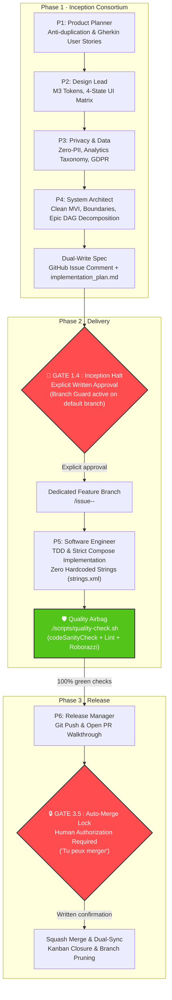

# 🛡️ Agentic Android Delivery Kernel

> **The Deterministic Multi-Agent Governance Protocol for Production Android Apps**  
> *Powered by Google Antigravity · Jetpack Compose · Roborazzi · Gradle Quality Airbag*

---

## 🌟 Overview

Autonomous AI coding agents often derail when given unbounded write access to production codebases:
* **Direct commits on `main` / `master`** bypassing branch reviews.
* **Premature implementation** without sealed product specifications or user consent.
* **Unmonitored merges** and unverified tests causing silent regressions.
* **Hardcoded UI literals** breaking internationalization and accessibility.

**Agentic Android Delivery Kernel** is an architectural framework and deterministic micro-kernel (< 10 KB) designed to enforce strict software engineering discipline on AI agents. It orchestrates **6 specialized personas** governed by a sequential state machine with **2 human-in-the-loop blocking gates**.

---

## 🏛️ Sequential Persona State Machine & Gating Locks



---

## 👥 The 6 Engineering Personas

| Persona | Role | Key Deliverable | Tools Allowed / Denied |
|---|---|---|---|
| **P1 · Product Planner** | Product Management | Sealed Issue, Gherkin User Stories, 3-State Access Matrix | Read & GitHub issues only. **No code.** |
| **P2 · Design Lead** | UI/UX & Design Tokens | Material 3 tokens (`DESIGN.md`), 4-state UI matrix, Roborazzi specs | Design specs & assets. |
| **P3 · Privacy & Data** | Compliance & Telemetry | Zero-PII analytics taxonomy (`docs/analytics-taxonomy.md`), GDPR | Telemetry & data models. |
| **P4 · System Architect** | Architecture & Tech Lead | Clean MVI boundaries, DAG Epic decomposition (< 300 LOC) | Read-only verification. **No code.** |
| **P5 · Software Engineer** | Senior Android Developer | Production Kotlin/Compose code, atomic commits, TDD | Writes strictly in dedicated branch. |
| **P6 · Release Manager** | QA & Release Management | Quality Airbag execution, PR Walkthrough, Zero Auto-Merge Lock | PR lifecycle & deployment. |

---

## ⚙️ Declarative Configuration (`kernel.config.json`)

All repository-specific parameters are extracted into a single declarative file validated by `kernel.config.schema.json`:

```json
{
  "$schema": "./kernel.config.schema.json",
  "project": {
    "name": "My Android App",
    "description": "Production Android app governed by Antigravity",
    "version": "1.0.0"
  },
  "git": {
    "owner": "my-org",
    "repo": "my-android-app",
    "defaultBranch": "main"
  },
  "android": {
    "namespace": "com.example.myapp",
    "applicationId": "com.example.myapp",
    "minSdk": 26,
    "targetSdk": 35,
    "compileSdk": 35
  },
  "airbag": {
    "checkCommand": "./scripts/quality-check.sh",
    "validateDocsCommand": "./scripts/validate-docs.sh",
    "enforceZeroHardcodedStrings": true
  },
  "delivery": {
    "firebase": {
      "enabled": false,
      "appId": "",
      "testerGroups": "testers, dev",
      "artifactPath": "app/build/outputs/apk/release/app-release.apk"
    }
  }
}
```

---

## 🚀 Quickstart in 3 Steps

### 1. Configure the Kernel
Clone the repository and edit `kernel.config.json` with your project coordinates:
```bash
git clone https://github.com/<owner>/agentic-android-delivery-kernel.git my-app
cd my-app
# Edit kernel.config.json
```

### 2. Install Git Hooks
Bind local git hooks to `.agent/hooks` (`pre-commit-airbag.sh` and `branch-guard.mjs`):
```bash
./scripts/install-hooks.sh
```

### 3. Verify the Quality Airbag
Ensure compilation, Android Lint, and Roborazzi screenshot assertions pass 100% green:
```bash
./scripts/quality-check.sh
```

---

## 📦 Reference Implementation Included

The repository includes a working Android Compose starter:
* **Clean Compose Activity**: `app/src/main/` with Material 3 theming.
* **Roborazzi Screenshot Test**: `app/src/test/.../GreetingPreviewScreenshotTest.kt` verifying pixel-level rendering.
* **Airbag Gradle Task**: `./gradlew codeSanityCheck` verifying debug & release lint, unit tests, and screenshots.

---

## 📄 License

Distributed under the **Apache-2.0 License**. See `LICENSE` for details.
