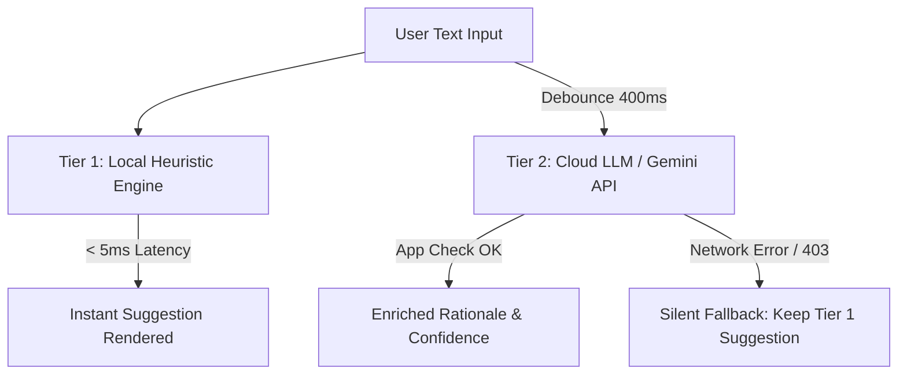

# 🧠 QA Test Guide & Two-Tier AI Verification Reference

This document establishes the quality assurance standards, defect classification matrix, and verification protocols for applications powered by the **Agentic Android Delivery Kernel**, with emphasis on the **Two-Tier Hybrid AI Architecture (Local Heuristics + Cloud LLM)** and the **3-State Access Matrix**.

---

## 🚦 1. Defect Severity & Classification Matrix

Persona 6 (Release Manager) and QA engineers qualify all anomalies and regressions using three standard severity tiers:

| Severity | Criteria | Impact | SLA / Resolution Path |
|---|---|---|---|
| **P0 · Blocker** | Application crash on launch, fatal exception, database migration corruption, security bypass, or broken primary user flow. | Total blockage or data loss. | Immediate triage, circuit breaker halted, hotfix release. |
| **P1 · Major** | Functional flow regression without viable workaround, sync failure in Duo state, authentication loop, or AI suggestion failure with no local fallback. | Degraded core functionality. | Blocking for milestone release train; fixed in active sprint. |
| **P2 · Minor** | Visual glitch, theme token misalignment, animation stutter, minor localization typo, or non-blocking edge-case delay. | Cosmetic or low friction. | Scheduled in standard backlog sprint. |

### 🔍 Bug Report Qualification Checklist
Before submitting a defect, verify:
1. **Deterministic Steps to Reproduce**: Minimal step-by-step sequence from a clean application state.
2. **Environment Specification**: Device model, Android OS version / API level, and build variant (`debug` vs `release`).
3. **Behavioral Contrast**: Clear statement of Expected Behavior vs Actual Observed Behavior.
4. **Logcat / Stacktrace**: Clean log snippet isolated to application process, sanitized of any PII.

---

## 🧭 2. 3-State Access Matrix QA Protocols

Every feature and data flow must be verified across the 3 fundamental access states:

```
               ┌────────────────────────────────────────────────────────┐
               │              3-STATE ACCESS ARCHITECTURE               │
               └────────────────────────────────────────────────────────┘
                       │                     │                     │
                       ▼                     ▼                     ▼
               ┌───────────────┐     ┌───────────────┐     ┌───────────────┐
               │  GUEST STATE  │     │  SOLO STATE   │     │   DUO STATE   │
               │  100% Local   │     │ Personal Cloud│     │ Shared Sync   │
               └───────────────┘     └───────────────┘     └───────────────┘
```

### A. Guest State (Unauthenticated / Offline)
* **Storage Invariant**: 100% local persistence via Room SQLite.
* **Network Invariant**: Zero unsolicited cloud database or storage network requests.
* **Soft-Gating**: Attempting to access cloud synchronization or partner pairing triggers a gentle non-blocking sign-in dialogue without crashing.

### B. Solo State (Authenticated User)
* **Namespace Isolation**: Reads and writes are scoped strictly to the authenticated user's private cloud namespace (e.g., `/users/{userId}`).
* **Telemetry & Settings**: User preferences, theme modes, and Zero-PII analytics operate in personal mode.

### C. Duo State (Shared Collaboration)
* **Shared Workspace**: Real-time bidirectional synchronization scoped to the shared workspace namespace.
* **Concurrency & Conflicts**: Verified using 2 simultaneous test devices/emulators to validate conflict resolution.
* **Pairing Lifecycle**: Complete end-to-end verification of pairing generation, code submission, active sync, and clean disconnection.

---

## ⚡ 3. Two-Tier Hybrid AI Engine Architecture

Applications leveraging the kernel's cognitive assistance implement a Two-Tier hybrid model ensuring high availability, zero latency, and graceful offline degradation:



### Tier 1 — Local Deterministic Classifier (`< 5ms`)
* **Instant Feedback**: Executes synchronously on the main/background thread with 0 ms network overhead.
* **Deterministic Tokenization**: Strict Unicode boundary matching (`\p{L}`) handling accents and multilingual tokens without substring false positives.
* **Guaranteed Fallback**: Always provides an initial category/priority recommendation regardless of connectivity.

### Tier 2 — Cloud LLM Inference (Gemini Flash via Firebase AI Logic)
* **Asynchronous Deep Reasoning**: Triggered with debounce (e.g., 400ms after user pauses typing or loses focus).
* **Structured Output Parsing**: Enforces strict schema validation (JSON / Type-safe response) to prevent hallucinated keys or unparseable payloads.
* **App Check Security**: Enforces Play Integrity in production and debug providers in local test environments.
* **Resilience Guarantee**: If network fails, API limits are reached, or App Check returns HTTP 403 on emulators, errors are intercepted cleanly. The Tier 1 local suggestion remains active, and Crashlytics is not spammed.

---

## 📋 4. Archetype AI Suggestion & Multi-Category Test Protocol

Rather than testing arbitrary domain strings, QA suites should validate the **Architectural Qualification Grid** covering the full permutation of categories and priority tiers:

| Dimension | Qualification Criteria | Expected Engine Behavior |
|---|---|---|
| **Urgent & High Impact** | Immediate deadline, high-risk consequence, crisis action. | Tier 1 & Tier 2 converge on highest immediate priority tier. |
| **Important & Strategic** | Long-term planning, foundational projects, preventive actions. | Classified as scheduled/deliberate action without panic markers. |
| **Collaborative / Shared** | Explicit mention of collaborator, delegation, or joint responsibility. | Routed to shared/collaborative workspace or partner suggestion. |
| **Low-Urgency / Backlog** | Exploratory thoughts, wishlists, future ideas (*"someday-maybe"*). | Parked in low-priority sanctuary/backlog without deadlines. |

### Golden Test Dataset Pattern
Deterministic unit tests validate the classification engine using parameterized golden datasets:

```kotlin
@Test
fun verifyCategoryAndPriorityPermutations() {
    // Assert all permutations of category and priority tiers map correctly
    // across both Tier 1 heuristic triggers and Tier 2 structured responses.
}
```

### Roborazzi Visual Regression UI States
Visual snapshot tests must capture the 4 canonical states of AI-assisted entry surfaces:
1. **Empty / Default State**: Unfocused input with placeholder.
2. **Typing / Tier 1 Fast State**: Instant suggestion chip displayed under input.
3. **Tier 2 Enriched State**: Refined suggestion with rationale and confidence indicator.
4. **Offline / Error Fallback**: Clean UI maintaining Tier 1 suggestion with zero error dialogs.

---

## 🧪 5. Automated Testing Execution & CI Verification

Run the complete verification pipeline locally:

```bash
# 1. Run unit test suite
./gradlew testDebugUnitTest --tests "*ClassifierTest*"

# 2. Run full quality airbag (Lint, compilation, tests)
./scripts/quality-check.sh

# 3. Validate documentation contracts and byte budgets
./scripts/validate-docs.sh
```
