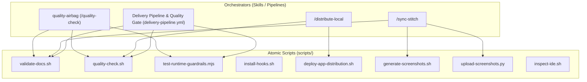

# 🛠️ Scripts Reference & Automation Architecture

> **Project**: Agentic Android Kernel (Android & Google Stitch)  
> **Source of Truth**: `docs/scripts-reference.md` • [`scripts/README.md`](../scripts/README.md)  
> **Companion Skills & Pipelines**: [`.agent/skills/`](../.agent/skills/) • [`.agent/playbooks/`](../.agent/playbooks/) • [`.github/workflows/`](../.github/workflows/)

---

## 1. Vision & Architecture: Atomic Scripts & Semantic Skills Composition

The **Agentic Android Kernel** project enforces a strict automation architecture rooted in the **Single Responsibility Principle (SRP)**:

1. **Atomic Scripts (Single Responsibility)**:
   Every script under `scripts/` fulfills a **single deterministic function** (e.g., validating documentation contracts, running Android build sanity checks, testing runtime security guardrails, or uploading screenshots to Stitch).
2. **Composition via Semantic Skills & Pipelines (Orchestration)**:
   Complex multi-step workflows are not hardcoded into brittle monolithic scripts, but orchestrated via:
   - **Agent Semantic Skills** ([`.agent/skills/`](../.agent/skills/)) driven by user intents and slash commands (`plan-issue`, `open-pr`, `quality-airbag`, `distribute-local`, `sync-stitch`, `triage-feedback`).
   - **GitHub Actions CI/CD Pipelines** ([`.github/workflows/`](../.github/workflows/)) (`delivery-pipeline.yml`).



---

## 2. Complete Scripts Directory

| Script File | Language | Nature | Single Responsibility | Triggers / Skills |
|---|---|---|---|---|
| [`scripts/validate-docs.sh`](../scripts/validate-docs.sh) | Bash | Atomic | Validates structural integrity and byte budget compliance across all architecture contracts (`DESIGN.md`, `design-system.md`, `AGENTS.md`, playbooks, skills, rules). | `quality-airbag`, `sync-stitch`, `delivery-pipeline.yml` |
| [`scripts/quality-check.sh`](../scripts/quality-check.sh) | Bash | Atomic | Executes the full Gradle suite: Kotlin/Java compilation, Android Lint Debug/Release, unit tests, and Robolectric/Roborazzi UI tests. | `quality-airbag`, `open-pr`, `delivery-pipeline.yml` |
| [`scripts/test-runtime-guardrails.mjs`](../scripts/test-runtime-guardrails.mjs) | Node.js (ESM) | Atomic | Runs 18 security assertions verifying PoLP tool revocation, `plan-guard.mjs`, and `branch-guard.mjs` path hardening. | `quality-airbag`, CI |
| [`scripts/install-hooks.sh`](../scripts/install-hooks.sh) | Bash | Atomic | Binds local Git hooks to `.agent/hooks/` and guarantees executable permissions on all hook scripts. | Developer onboarding, setup |
| [`scripts/deploy-app-distribution.sh`](../scripts/deploy-app-distribution.sh) | Bash | Atomic | Builds the APK and deploys to Firebase App Distribution with monotonic version multiplier (x100) and formatted release notes. | `distribute-local`, Ad-hoc tester release |
| [`scripts/generate-screenshots.sh`](../scripts/generate-screenshots.sh) | Bash | Atomic | Executes Robolectric/Roborazzi UI tests to record and generate local screenshots in `build/outputs/roborazzi`. | `sync-stitch`, Design System capture update |
| [`scripts/upload-screenshots.py`](../scripts/upload-screenshots.py) | Python 3 | Atomic | Validates and maps Roborazzi screenshot baselines to Google Stitch `screen_id`s for in-place synchronization. | `sync-stitch`, `upload-screenshots.py` |
| [`scripts/inspect-ide.sh`](../scripts/inspect-ide.sh) | Bash | Atomic | Executes Android Studio / IntelliJ IDEA code inspection engine in headless mode with default project profiles. | Advanced IDE quality audit |

---

## 3. Detailed Script Reference Sheets

### 3.1 `scripts/validate-docs.sh`
* **Role**: Quality gatekeeper for documentation integrity and multi-agent architectural contract compliance.
* **Checks performed**:
  - Presence of core contracts: `DESIGN.md`, `design-system.md`, `AGENTS.md`, `agent.md`, `README.md`, `ARCHITECTURE.md`.
  - Presence and size budgets of master rules: `agent-lifecycle.md`, `backlog-planner.md`, `git-workflow.md`, `firebase-standards.md`.
  - Presence and size budgets of playbooks: `room-migrations.md`, `roborazzi-export.md`, `compose-theming.md`, `android-standards.md`.
  - Presence of semantic skills: `plan-issue`, `open-pr`, `quality-airbag`, `sync-stitch`.
  - Presence and executable flags on hooks: `pre-commit-airbag.sh`, `post-merge-dual-sync.sh`, `branch-guard.mjs`, `plan-guard.mjs`, `pre-invocation-anchor.sh`.
  - YAML frontmatter validity in `DESIGN.md` (`Serene Intellectual`).
* **Usage**:
  ```bash
  ./scripts/validate-docs.sh
  ```
* **Exit Codes**: `0` (Success, 100% validated), `1` (Failure, at least one contract or file missing/over-budget).

---

### 3.2 `scripts/quality-check.sh`
* **Role**: Primary compilation and static analysis airbag for Android.
* **Actions executed**:
  - Automatic detection and portable configuration of `JAVA_HOME` (Android Studio JBR / JDK 21).
  - Execution of `./gradlew codeSanityCheck --stacktrace`:
    1. Kotlin compiler checks (progressive mode & opt-in annotations).
    2. Java compiler warnings (`-Xlint:all`).
    3. Android Lint Debug & Release (Compose, security, i18n, performance).
    4. Unit tests and Robolectric/Roborazzi UI tests.
* **Usage**:
  ```bash
  ./scripts/quality-check.sh
  ```
* **Generated Reports**:
  - `app/build/reports/lint-results-debug.html`
  - `app/build/reports/lint-results-release.html`
  - `app/build/reports/tests/testDebugUnitTest/index.html`

---

### 3.3 `scripts/test-runtime-guardrails.mjs`
* **Role**: Offline security test suite for runtime guardrails and PoLP persona configurations.
* **Verifications (18 assertions)**:
  - **PoLP Tool Access**: Verifies `run_command` is denied/revoked for P1, P2, P3, and P4 personas.
  - **Plan Guard (`plan-guard.mjs`)**: Rejection of `--no-verify`, `-c core.hooksPath` bypasses, commits on `main`, and pushes to `main`.
  - **Branch Guard (`branch-guard.mjs`)**: Canonical path hardening preventing write operations to repository files while on `main`.
* **Usage**:
  ```bash
  node scripts/test-runtime-guardrails.mjs
  ```

---

### 3.4 `scripts/install-hooks.sh`
* **Role**: Binds local Git hooks to `.agent/hooks/` and guarantees executable permissions.
* **Actions executed**:
  - Sets executable permissions on `.agent/hooks/*.sh` and `*.mjs`.
  - Symlinks standard Git `pre-commit` to `pre-commit-airbag.sh`.
  - Configures Git `core.hooksPath` to `.agent/hooks`.
* **Usage**:
  ```bash
  ./scripts/install-hooks.sh
  ```

---

### 3.5 `scripts/deploy-app-distribution.sh`
* **Role**: Direct build and distribution to Firebase App Distribution from the local developer terminal.
* **Workflow**:
  1. Detects `service-account.json`.
  2. Calculates Git version metadata (`versionCode` using monotonic multiplier x100, `versionName` with SemVer tag and commits ahead).
  3. Formats release notes: `v<versionName> (build <versionCode>) : <message>`.
  4. Compiles (`assembleDebug` or `assembleRelease`) and uploads (`appDistributionUploadDebug` or `appDistributionUploadRelease`).
  5. Cleans up temporary `release-notes.txt` artifacts.
* **Arguments & Options**:
  - `[notes]`: User-facing message for testers (default: latest Git commit message).
  - `[variant]`: `release` (default) or `debug`.
  - `--groups, -g`: Targeted Firebase tester groups (default: `admin, testers`).
* **Examples**:
  ```bash
  # 1. Standard release distribution
  ./scripts/deploy-app-distribution.sh

  # 2. With custom release notes
  ./scripts/deploy-app-distribution.sh "Fix duo sync state"

  # 3. Release APK for internal admins
  ./scripts/deploy-app-distribution.sh "RC v0.2.0" release --groups "admin"
  ```

---

### 3.6 `scripts/upload-screenshots.py`
* **Role**: Deterministic mapping and upload of Roborazzi UI screenshots to Google Stitch screens.
* **Guarantees**:
  - Strict 1:1 mapping between local snapshots (`screenshots/stitch_export/*.png`) and Google Stitch `screen_id`s.
  - In-place screen updates preventing duplicate or orphaned screens in Stitch.
  - Pre-validation of PNG file existence and non-zero byte size.
* **CLI Options**:
  - `--project-id`: Google Stitch Project ID.
  - `--check-only`: Verifies presence and mapping of PNG files without uploading.
  - `--dry-run`: Simulates execution and outputs JSON/Base64 payloads.
* **Examples**:
  ```bash
  python3 scripts/upload-screenshots.py --check-only
  python3 scripts/upload-screenshots.py --dry-run
  ```

---

### 3.7 `scripts/generate-screenshots.sh`
* **Role**: Executes Robolectric and Roborazzi UI tests to record and update application screenshots locally in `build/outputs/roborazzi`.
* **Workflow**:
  - Executes `./gradlew recordRoborazziDebug --stacktrace`.
  - Produces verified screenshot assets required for Design System synchronization.
* **Usage**:
  ```bash
  ./scripts/generate-screenshots.sh
  ```

---

### 3.8 `scripts/inspect-ide.sh`
* **Role**: Headless IntelliJ IDEA / Android Studio static inspection runner.
* **Usage**:
  ```bash
  ./scripts/inspect-ide.sh
  ```

---

## 4. Composition Matrix (Skills & Pipelines ➔ Scripts & MCP)

| Skill / Pipeline | Invoked Tools (in execution order) |
|---|---|
| **`quality-airbag`** (`/quality-check`) | 1. `scripts/validate-docs.sh`<br>2. `scripts/quality-check.sh`<br>3. `scripts/test-runtime-guardrails.mjs` |
| **`open-pr`** (`/open-pr`) | 1. `scripts/quality-check.sh` (Full quality airbag)<br>2. Walkthrough generation & PR creation |
| **`distribute-local`** (`/distribute-local`) | 1. `scripts/quality-check.sh` (Recommended)<br>2. `scripts/deploy-app-distribution.sh` |
| **`sync-stitch`** (`/sync-stitch`) | 1. `scripts/validate-docs.sh`<br>2. `scripts/generate-screenshots.sh`<br>3. `scripts/upload-screenshots.py` |
| **`triage-feedback`** (`/triage-feedback`) | 100% native MCP (`GitHubMCP`: `search_issues`, `add_issue_comment`, `create_issue`) |
| **Delivery Pipeline & Quality Gate (`delivery-pipeline.yml`)** | 1. `scripts/validate-docs.sh`<br>2. `scripts/quality-check.sh` (`./gradlew codeSanityCheck`)<br>3. APK build & Firebase App Distribution deployment via Gradle |

