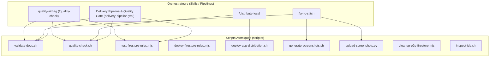

# 🛠️ Scripts Reference & Automation Architecture

> **Project**: Agentic Android Kernel (Android & Google Stitch)  
> **Source of Truth**: `docs/scripts-reference.md` • [`scripts/README.md`](../scripts/README.md)  
> **Companion Skills & Pipelines**: [`.agent/skills/`](../.agent/skills/) • [`.agent/playbooks/`](../.agent/playbooks/) • [`.github/workflows/`](../.github/workflows/)

---

## 1. Vision & Architecture : Scripts Atomiques & Composition par Compétences Sémantiques

Le projet **Agentic Android Kernel** adopte une architecture d'automatisation stricte basée sur le principe de **responsabilité unique (SRP)** :

1. **Scripts Atomiques (Single Responsibility)** :
   Chaque script dans `scripts/` remplit une **unique fonction déterministe** (ex: valider les contrats documentaires, exécuter les tests de compilation Android, vérifier les règles Firestore, ou téléverser les captures sur Stitch).
2. **Composition par Compétences Sémantiques & Pipelines (Orchestration)** :
   Les enchaînements complexes de tâches ne sont pas codés en dur dans de gros scripts monolithiques, mais orchestrés via :
   - Les **Compétences Sémantiques de l'Agent** ([`.agent/skills/`](../.agent/skills/)) pilotées par intentions et commandes (`plan-issue`, `open-pr`, `quality-airbag`, `distribute-local`, `sync-stitch`, `triage-feedback`).
   - Les **Pipelines CI/CD GitHub Actions** ([`.github/workflows/`](../.github/workflows/)) (`delivery-pipeline.yml`).



---

## 2. Répertoire Complet des Scripts

| Fichier Script | Langage | Nature | Responsabilité Unique | Déclencheurs / Skills |
|---|---|---|---|---|
| [`scripts/validate-docs.sh`](../scripts/validate-docs.sh) | Bash | Atomique | Valide l'intégrité et la conformité des contrats documentaires (`DESIGN.md`, `design-system.md`, `agent.md`, playbooks, skills, règles). | `quality-airbag`, `sync-stitch`, `delivery-pipeline.yml` |
| [`scripts/quality-check.sh`](../scripts/quality-check.sh) | Bash | Atomique | Exécute la suite Gradle complète de compilation Kotlin/Java, Lint Android Debug/Release, et tests unitaires/Robolectric. | `quality-airbag`, `open-pr`, `delivery-pipeline.yml` |
| [`scripts/test-firestore-rules.mjs`](../scripts/test-firestore-rules.mjs) | Node.js (ESM) | Atomique | Teste localement `firestore.rules` contre 16 assertions de sécurité (moindre privilège, isolation couple, absence d'escalade). | `quality-airbag`, CI, Debug Screen |
| [`scripts/deploy-firestore-rules.mjs`](../scripts/deploy-firestore-rules.mjs) | Node.js (ESM) | Atomique | Déploie et publie `firestore.rules` directement sur Google Cloud / Firebase via l'API REST avec JWT compte de service. | Déploiement manuel sécurisé |
| [`scripts/deploy-app-distribution.sh`](../scripts/deploy-app-distribution.sh) | Bash | Atomique | Compile l'APK et l'envoie sur Firebase App Distribution avec calcul automatique de version et notes formatées. | `distribute-local`, Déploiement testeurs ad-hoc |
| [`scripts/generate-screenshots.sh`](../scripts/generate-screenshots.sh) | Bash | Atomique | Exécute les tests d'UI Robolectric/Roborazzi pour générer ou mettre à jour les captures d'écran en local. | `sync-stitch`, Génération des captures Roborazzi |
| [`scripts/upload-screenshots.py`](../scripts/upload-screenshots.py) | Python 3 | Atomique | Valide et mappe les 10 captures Roborazzi sur les `screen_id` Stitch existants pour mise à jour in-place (zéro hallucination). | `sync-stitch`, `upload-screenshots.py` |
| [`scripts/cleanup-e2e-firestore.mjs`](../scripts/cleanup-e2e-firestore.mjs) | Node.js (ESM) | Atomique | Purge les documents de sondes de test créés dans la collection Firestore `/users`. | Maintenance et tests de sonde |
| [`scripts/inspect-ide.sh`](../scripts/inspect-ide.sh) | Bash | Atomique | Exécute le moteur d'inspection complet d'Android Studio / IntelliJ en mode headless avec profil par défaut. | Audit qualité avancé IDE |

---

## 3. Fiches Détaillées par Script

### 3.1 `scripts/validate-docs.sh`
* **Rôle** : Gardien de l'intégrité documentaire et de la conformité des contrats d'architecture.
* **Vérifications effectuées** :
  - Présence de `DESIGN.md`, `design-system.md`, `agent.md`, `README.md`, `README.fr.md`.
  - Présence des règles maîtresses : `agent-lifecycle.md`, `backlog-planner.md`, `git-workflow.md`.
  - Présence des playbooks : `room-migrations.md`, `firestore-security.md`, `roborazzi-export.md`, `compose-theming.md`.
  - Présence des compétences sémantiques : `plan-issue.md`, `open-pr.md`, `quality-airbag.md`, `distribute-local.md`, `triage-feedback.md`, `sync-stitch.md`.
  - Validité du frontmatter YAML dans `DESIGN.md` (`Serene Intellectual`).
* **Utilisation** :
  ```bash
  ./scripts/validate-docs.sh
  ```
* **Codes de sortie** : `0` (Succès, 100% validé), `1` (Échec, au moins un fichier ou contrat manquant).

---

### 3.2 `scripts/quality-check.sh`
* **Rôle** : Airbag qualité de compilation et d'analyse statique Android.
* **Actions exécutées** :
  - Détection et initialisation automatique de `JAVA_HOME` (Android Studio JBR / JDK 21).
  - Exécution de `./gradlew codeSanityCheck --stacktrace` :
    1. Compilateur Kotlin (checks progressifs & annotations opt-in).
    2. Compilateur Java (`-Xlint:all`).
    3. Android Lint Debug & Release (Compose, sécurité, i18n, performance).
    4. Tests unitaires et tests UI Robolectric (135+ tests).
    5. Compatibilité Jetifier & AndroidX.
* **Utilisation** :
  ```bash
  ./scripts/quality-check.sh
  ```
* **Rapports générés** :
  - `app/build/reports/lint-results-debug.html`
  - `app/build/reports/lint-results-release.html`
  - `app/build/reports/tests/testDebugUnitTest/index.html`

---

### 3.3 `scripts/test-firestore-rules.mjs`
* **Rôle** : Suite de tests de sécurité et de non-régression hors-ligne pour `firestore.rules`.
* **Vérifications assurées (16 assertions)** :
  - **Suite 1 (Structure)** : `rules_version = '2'`, helpers `isAuthenticated()`, `isCoupleMember()`, `isMemberOfCouple()`.
  - **Suite 2 (Accès Moindre Privilège)** : Cloisonnement `/users/{userId}`, `/invites/`, `/pairings/`, `/couples/{coupleId}`, `/loads/{loadId}`, rejet par défaut `allow read, write: if false;`.
  - **Suite 3 (Anti-Régression)** : 0 règle ouverte `if true`, 0 écriture non vérifiée `if request.auth != null`, isolation stricte des sanctuaires de test `SANCTUARY-TEST*`.
* **Utilisation** :
  ```bash
  node scripts/test-firestore-rules.mjs
  ```

---

### 3.4 `scripts/deploy-firestore-rules.mjs`
* **Rôle** : Déploiement programmatique sécurisé des règles Firestore sans dépendre de la CLI Firebase.
* **Fonctionnement** :
  1. Lit `service-account.json` et génère un JWT signé RSA-SHA256 (scope `cloud-platform datastore`).
  2. Crée un nouveau ruleset via l'API REST `firebaserules.googleapis.com/v1/projects/{projectId}/rulesets`.
  3. Met à jour la release `projects/{projectId}/releases/cloud.firestore`.
* **Prérequis** : `service-account.json` valide avec rôle Firebase Rules Admin.
* **Utilisation** :
  ```bash
  node scripts/deploy-firestore-rules.mjs
  ```

---

### 3.5 `scripts/deploy-app-distribution.sh`
* **Rôle** : Construction et distribution directe sur Firebase App Distribution depuis le terminal local.
* **Fonctionnement** :
  1. Détecte `service-account.json`.
  2. Calcule la version Git (`versionCode` = nombre total de commits, `versionName` = tag SemVer + commits ahead).
  3. Formate les notes de version : `v<versionName> (build <versionCode>) : <message>`.
  4. Compile (`assembleDebug` ou `assembleRelease`) et téléverse (`appDistributionUploadDebug` ou `appDistributionUploadRelease`).
  5. Nettoie les fichiers temporaires `release-notes.txt`.
* **Arguments & Options** :
  - `[notes]` : Message explicatif pour les testeurs (défaut : message du dernier commit Git).
  - `[variant]` : `release` (défaut) ou `debug`.
  - `--groups, -g` : Groupes de testeurs Firebase ciblés (défaut : `admin, testers`).
* **Exemples** :
  ```bash
  # 1. Distribution standard
  ./scripts/deploy-app-distribution.sh

  # 2. Avec notes personnalisées
  ./scripts/deploy-app-distribution.sh "Correction synchronisation duo"

  # 3. Release APK pour testeurs internes
  ./scripts/deploy-app-distribution.sh "RC v0.2.0" release --groups "admin"
  ```

---

### 3.6 `scripts/upload-screenshots.py`
* **Rôle** : Mappage et téléversement déterministe des captures Roborazzi sur les écrans Stitch.
* **Garanties** :
  - Mappage 1:1 strict entre 10 captures locales (`screenshots/stitch_export/*.png`) et 10 `screen_id` Google Stitch.
  - Mise à jour strictly in-place (interdiction formelle de créer des écrans orphelins).
  - Validation préalable de l'existence et du poids de chaque fichier PNG.
* **Options CLI** :
  - `--project-id` : ID du projet Stitch (défaut : `<stitch-project-id>`).
  - `--check-only` : Vérifie la présence et le mappage des 10 PNGs sans téléversement.
  - `--dry-run` : Simule l'exécution et affiche les payloads JSON/Base64.
* **Exemples** :
  ```bash
  python3 scripts/upload-screenshots.py --check-only
  python3 scripts/upload-screenshots.py --dry-run
  ```

---

### 3.7 `scripts/generate-screenshots.sh`
* **Rôle** : Exécute les tests d'UI Robolectric et Roborazzi pour enregistrer et générer localement les captures d'écran de l'application dans `build/outputs/roborazzi`.
* **Fonctionnement** :
  - Lance `./gradlew recordRoborazziDebug --stacktrace`.
  - Produit les captures d'écran requises pour la validation et la synchronisation du Design System.
* **Utilisation** :
  ```bash
  ./scripts/generate-screenshots.sh
  ```

---

### 3.8 `scripts/cleanup-e2e-firestore.mjs`
* **Rôle** : Nettoyage et purge des documents Firestore de sonde créés lors des tests d'authentification ou d'intégrité.
* **Fonctionnement** :
  - S'authentifie via `service-account.json`.
  - Liste les documents sous `/users` créés par les sondes de test.
  - Supprime chaque document unitairement via l'API REST Firestore.
* **Utilisation** :
  ```bash
  node scripts/cleanup-e2e-firestore.mjs
  ```

---

### 3.9 `scripts/inspect-ide.sh`
* **Rôle** : Inspection headless IntelliJ / Android Studio.
* **Utilisation** :
  ```bash
  ./scripts/inspect-ide.sh
  ```

---

## 4. Matrice de Composition (Skills & Pipelines ➔ Scripts & MCP)

| Skill / Pipeline | Outils Invoqués (dans l'ordre d'exécution) |
|---|---|
| **`quality-airbag`** (`/quality-check`) | 1. `scripts/validate-docs.sh`<br>2. `scripts/quality-check.sh`<br>3. `scripts/test-firestore-rules.mjs` |
| **`open-pr`** (`/open-pr`) | 1. `scripts/quality-check.sh` (Airbag qualité complet) |
| **`distribute-local`** (`/distribute-local`) | 1. `scripts/quality-check.sh` (Recommandé)<br>2. `scripts/deploy-app-distribution.sh` |
| **`sync-stitch`** (`/sync-stitch`) | 1. `scripts/validate-docs.sh`<br>2. `scripts/generate-screenshots.sh`<br>3. `scripts/upload-screenshots.py` |
| **`triage-feedback`** (`/triage-feedback`) | 100% MCP natif (`GitHubMCP` : `search_issues`, `add_issue_comment`, `create_issue`) |
| **Delivery Pipeline & Quality Gate (`delivery-pipeline.yml`)** | 1. `scripts/validate-docs.sh`<br>2. `scripts/quality-check.sh` (`./gradlew codeSanityCheck`)<br>3. Compilation & Firebase App Distribution via Gradle |
